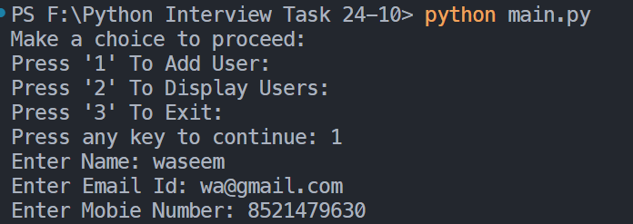
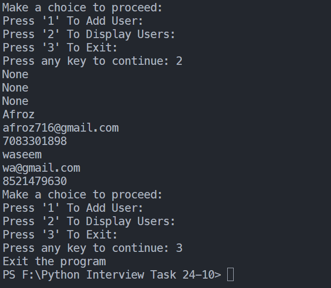

# Machine Test Project

This project is a Python script that allows users to add and display user details from an Excel file (`MachineTest.xlsx`) using OpenPyXL.

## Features
- Add user details including Name, Email, and Mobile Number.
- Display all user details stored in the Excel file.

## Requirements
- `openpyxl` library

## Output

